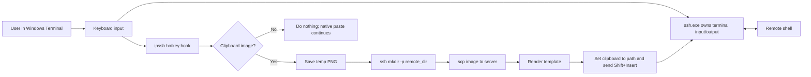

# ipssh

`ipssh` is short for image paste ssh. It is a Windows OpenSSH wrapper for pasting clipboard images into an SSH session.

When working on a remote SSH server with AI coding tools such as Claude Code, Codex, and similar terminal-based assistants, pasting screenshots or other images is usually not supported. Some SSH clients also handle multiline text paste poorly and send it as multiple shell commands.

`ipssh` solves the image case while preserving normal terminal behavior. It starts the normal `ssh.exe` client, keeps input and output owned by Windows Terminal and OpenSSH, and adds one feature: when the configured image paste hotkey is pressed and the Windows clipboard contains an image, `ipssh` uploads the image with `scp` and pastes the remote image path into the active SSH session.

`ipssh` does not implement the SSH protocol. It calls the `ssh.exe` and `scp.exe` command-line tools already installed on Windows. These are commonly available from the Windows OpenSSH optional feature or from the Windows Git installer.

For design details, see [docs/design.md](docs/design.md).

## How It Works

`ipssh` does not implement its own terminal emulator. The SSH process inherits the current console, so ordinary input, `Shift+Insert`, multiline paste, `Ctrl+C`, `Ctrl+D`, colors, and full-screen terminal programs behave like plain OpenSSH.

In parallel, a background worker installs a low-level Windows keyboard hook for the configured hotkey. When that hotkey is pressed, the worker checks the clipboard. If the clipboard contains an image, it uploads the image through OpenSSH tools and temporarily places the generated remote path on the clipboard, then simulates `Shift+Insert` to paste the path into the SSH session. If the same clipboard image is pasted again in the same `ipssh` session, the previous remote path is reused without uploading again. If the clipboard is not an image, `ipssh` does nothing and the terminal handles the paste normally.



## Requirements

- Windows 10 or Windows 11.
- OpenSSH client tools available on `PATH`: `ssh.exe` and `scp.exe`. These are often installed with Windows Git.
- A reachable SSH target, such as `user@host` or a host alias in `%USERPROFILE%\.ssh\config`.

Check OpenSSH from PowerShell:

```powershell
ssh -V
scp -V
```

`scp -V` may print usage text instead of a version. That is acceptable as long as the command exists.

## Installation

Run the installer:

```powershell
.\ipssh-0.1.1-windows-x64-installer.exe
```

Default install paths:

```text
Binary: %LOCALAPPDATA%\Programs\ipssh\ipssh.exe
Config: %APPDATA%\ipssh\config.toml
```

The installer creates the default config file only when it does not already exist. It also adds the program directory to the current user's `PATH` unless `--no-path` is used.

Open a new PowerShell or Windows Terminal window after installation, then verify:

```powershell
ipssh --help
```

Install without modifying `PATH`:

```powershell
.\ipssh-0.1.1-windows-x64-installer.exe --no-path
```

Uninstall:

```powershell
.\ipssh-0.1.1-windows-x64-installer.exe --uninstall
```

Uninstall removes the program and PATH entry. It leaves the user config file in place.

## Basic Usage

Connect like `ssh`:

```powershell
ipssh user@example.com
```

Use an SSH config host alias:

```powershell
ipssh my-server
```

Pass OpenSSH options after `--` when needed:

```powershell
ipssh -- user@example.com -p 2222 -i C:\Users\me\.ssh\id_ed25519
```

Common options such as `-p`, `-i`, `-F`, `-J`, and `-o` are reused for upload subprocesses. `ipssh` converts `ssh -p` to `scp -P` automatically.

## Windows Terminal Profile

`ipssh` is designed to work well with Windows Terminal. A convenient setup is to create a dedicated Windows Terminal profile whose command line starts PowerShell and then runs `ipssh`.

Example command line:

```text
%SystemRoot%\System32\WindowsPowerShell\v1.0\powershell.exe "ipssh james@192.168.100.202"
```

Replace `james@192.168.100.202` with your SSH target or host alias.

## Pasting Images

1. Copy an image to the Windows clipboard.
2. Focus the `ipssh` terminal.
3. Press the configured image paste hotkey. The default is `Alt+V`.

`ipssh` will:

1. Save the clipboard image as a temporary PNG.
2. Run `ssh` to create the remote upload directory.
3. Run `scp` to upload the image.
4. Paste the rendered remote path into the active SSH session.

If the clipboard image has not changed since the previous image paste in the same `ipssh` session, `ipssh` skips `ssh` and `scp` and pastes the cached remote path again.

The default remote directory is:

```text
~/Pictures/paste-ssh
```

The default inserted text is the remote file path:

```text
~/Pictures/paste-ssh/20260521-153012-a1b2c3.png
```

## Text Paste

Text paste is handled by Windows Terminal and OpenSSH, not by `ipssh`.

This is intentional. `Shift+Insert`, multiline paste, shell bracketed paste behavior, and normal terminal editing should match a direct `ssh.exe` session. When the configured hotkey is pressed with text or empty clipboard content, `ipssh` does not upload anything and does not synthesize text input.

## Configuration

The default config file is:

```text
%APPDATA%\ipssh\config.toml
```

Example:

```toml
paste_hotkey = "alt+v"
remote_dir = "~/Pictures/paste-ssh"
image_format = "png"
non_image_paste = "text"
template = "{remote_path}"

[upload]
filename_pattern = "{timestamp}-{random}.{ext}"
```

Configuration values:

- `paste_hotkey`: Image paste hotkey. Examples: `alt+v`, `ctrl+shift+v`.
- `remote_dir`: Remote directory for uploaded images.
- `image_format`: Image output format. Currently supported: `png`.
- `non_image_paste`: Legacy/reserved setting. Current behavior leaves non-image paste to the terminal.
- `template`: Text pasted after upload.
- `filename_pattern`: Remote filename pattern.

Template variables:

- `{remote_path}`: Full remote path.
- `{remote_dir}`: Remote upload directory.
- `{filename}`: Generated filename.

Filename variables:

- `{timestamp}`: Local timestamp in `YYYYMMDD-HHMMSS` format.
- `{random}`: Six-character random suffix.
- `{ext}`: File extension, currently `png`.

## Command-Line Overrides

Command-line options override the config file.

Use a custom remote directory:

```powershell
ipssh --remote-dir "~/uploads" -- user@example.com
```

Insert Markdown image syntax:

```powershell
ipssh --template "" -- user@example.com
```

Use `Ctrl+Shift+V` as the image paste hotkey:

```powershell
ipssh --paste-hotkey "ctrl+shift+v" -- user@example.com
```

Use a different config file:

```powershell
ipssh --config C:\Users\me\ipssh.toml -- user@example.com
```

## SSH Authentication

`ipssh` delegates authentication to OpenSSH. It does not ask for, store, or reuse passwords internally.

Recommended setup:

- Put host settings in `%USERPROFILE%\.ssh\config`.
- Use key-based authentication.
- Use `ssh-agent` or OpenSSH connection reuse if repeated image uploads ask for credentials too often.

Example SSH config:

```sshconfig
Host my-server
    HostName example.com
    User alice
    Port 2222
    IdentityFile C:\Users\alice\.ssh\id_ed25519
```

Then connect:

```powershell
ipssh my-server
```

## Troubleshooting

### `ipssh` is not recognized

Open a new terminal after installing. If it still fails, check that this directory exists and is in the user `PATH`:

```text
%LOCALAPPDATA%\Programs\ipssh
```

You can also run the binary directly:

```powershell
& "$env:LOCALAPPDATA\Programs\ipssh\ipssh.exe" --help
```

### Image paste does not upload

Check these items:

- The clipboard contains image data, not a file path or HTML image reference.
- The configured hotkey matches what you pressed.
- `scp.exe` is available on `PATH`.
- A normal `ssh` and `scp` command can reach the same target.
- The remote directory is writable.

Try a plain command first:

```powershell
scp .\some-image.png user@example.com:~/Pictures/paste-ssh/
```

### Upload asks for a password every time

This is OpenSSH behavior. `ipssh` starts separate `ssh` and `scp` subprocesses for upload. Use key authentication, `ssh-agent`, or OpenSSH connection reuse to reduce repeated prompts.

### `Ctrl+D` exits the remote shell

This is normal SSH behavior. When the remote shell exits, `ipssh` returns to the Windows command prompt.

### The pasted path should be Markdown

Use a template:

```powershell
ipssh --template "" -- user@example.com
```

### The remote directory does not exist

`ipssh` automatically runs:

```sh
mkdir -p <remote_dir>
```

before upload. If that fails, check remote permissions and shell availability.

## Build From Source

Build the CLI:

```powershell
cargo build --release
```

The binary is:

```text
target\release\ipssh.exe
```

Build the Windows installer:

```powershell
powershell -ExecutionPolicy Bypass -File packaging\windows\build-installer.ps1
```

The installer is written to:

```text
dist\ipssh-0.1.1-windows-x64-installer.exe
```

Run tests:

```powershell
cargo test
$env:IPSSH_BIN='D:\git\image-paste-ssh\target\release\ipssh.exe'; cargo test --manifest-path packaging\windows\installer\Cargo.toml
```
