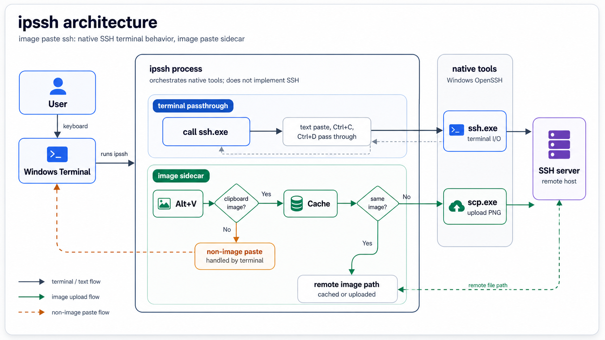

# ipssh Design

This document describes the final design of `ipssh`. Earlier design notes and implementation plans have been merged here and removed from the repository.

## Purpose

`ipssh` is short for image paste ssh. It is a Windows command-line wrapper around OpenSSH with an intentionally narrow job:

- Run a normal interactive `ssh.exe` session.
- Detect a configured image paste hotkey, defaulting to `Alt+V`.
- If the Windows clipboard contains an image, upload that image to the SSH target with `scp`.
- Paste the generated remote image path into the active SSH session.
- Leave ordinary terminal behavior to Windows Terminal and OpenSSH.

The tool does not manage SSH credentials, keys, agents, passwords, terminal emulation, or remote helper processes.

## Problem Context

Remote AI coding workflows increasingly happen inside SSH sessions. Tools such as Claude Code, Codex, and other terminal-based coding assistants can benefit from screenshots, UI captures, diagrams, and other image context, but a normal SSH terminal does not provide a convenient way to paste clipboard images into the remote environment.

Text paste also has to remain reliable. Some SSH clients or terminal wrappers handle multiline paste poorly and cause pasted lines to execute as separate shell commands. `ipssh` is designed to add image paste without taking ownership of ordinary terminal paste behavior.

`ipssh` does not implement the SSH protocol. It relies on the user's installed OpenSSH command-line tools, normally `ssh.exe` and `scp.exe`, which are commonly provided by Windows itself or the Windows Git installer.

## Final Architecture

The current architecture avoids a custom terminal bridge. `ssh.exe` is launched as a normal child process and inherits stdin/stdout/stderr from the current console. This preserves direct OpenSSH behavior for text paste, multiline paste, `Shift+Insert`, `Ctrl+C`, `Ctrl+D`, colors, terminal control sequences, and full-screen programs.

`ipssh` adds a sidecar worker thread. The worker installs a low-level Windows keyboard hook for the configured hotkey. The hook observes keydown events and sends a notification to the worker; it does not consume or rewrite keyboard input. The worker then checks the clipboard. Only image clipboard content is handled by `ipssh`. The worker keeps a one-entry in-memory cache for the last uploaded clipboard image and rendered remote path.



## Module Responsibilities

- `src/lib.rs`: CLI parsing, config loading, SSH argument parsing, and top-level orchestration.
- `src/config.rs`: TOML config loading, defaults, and command-line override merging.
- `src/hotkey.rs`: Parse hotkey strings such as `alt+v` and expose physical key state helpers.
- `src/ssh_args.rs`: Identify the SSH target and convert relevant `ssh` options to `scp` options.
- `src/remote_path.rs`: Generate filenames and remote paths.
- `src/template.rs`: Render inserted text from `{remote_path}`, `{remote_dir}`, and `{filename}`.
- `src/clipboard.rs`: Read Windows clipboard image/text data and save image data as PNG.
- `src/uploader.rs`: Run `ssh` for remote directory creation and `scp` for file upload.
- `src/terminal.rs`: Run the OpenSSH session, own the image hotkey worker, and paste uploaded paths.
- `packaging/windows/installer`: Build a simple per-user Windows installer.

## Data Flow

1. The user runs `ipssh [tool-options] -- [ssh-options] <target>`.
2. `ipssh` loads `%APPDATA%\ipssh\config.toml` unless a custom config path is supplied.
3. `ipssh` starts a background image hotkey worker.
4. `ipssh` starts `ssh.exe` with the user-provided SSH arguments.
5. `ssh.exe` owns the interactive terminal session.
6. When the configured hotkey is pressed, the worker checks the clipboard.
7. If the clipboard is not an image, the worker does nothing.
8. If the clipboard is an image:
   - Compare the image width, height, and RGBA bytes with the last uploaded clipboard image.
   - If unchanged, reuse the cached rendered remote path and skip upload.
   - Save it as a temporary PNG.
   - Generate the remote path.
   - Run `ssh <args> mkdir -p <remote_dir>`.
   - Run `scp <converted args> <temp.png> <target>:<remote_path>`.
   - Render the configured template.
   - Wait for the hotkey keys to be released.
   - Temporarily set the Windows clipboard to the rendered text.
   - Simulate `Shift+Insert` so the current terminal pastes the text.
   - Restore the previous clipboard content where possible.
9. When `ssh.exe` exits, `ipssh` stops the worker and returns the SSH exit code.

## Key Design Decisions

### OpenSSH Owns the Terminal

The project initially explored a ConPTY bridge and raw input handling. That approach made `ipssh` responsible for reconstructing terminal input and paste semantics. It caused subtle differences from plain OpenSSH, especially around multiline paste and terminal escape sequences.

The final design avoids that problem. `ipssh` delegates the terminal to `ssh.exe` and Windows Terminal. This keeps normal SSH behavior intact and makes the image feature a sidecar rather than a terminal replacement.

### Only Images Are Handled

The configured hotkey is an image upload shortcut. It is not a general paste implementation.

If the clipboard contains text, empty data, or unsupported data, `ipssh` does nothing. Native terminal paste behavior continues to apply. This is especially important for `Shift+Insert` and multiline text paste.

### Repeated Image Cache

Within one `ipssh` session, the worker remembers the most recently uploaded clipboard image and the rendered remote path it pasted. If the next image hotkey press sees the same width, height, and RGBA bytes, `ipssh` treats it as unchanged, skips `ssh`/`scp`, and pastes the same rendered path again. A different image replaces the cache after a successful upload.

### Low-Level Keyboard Hook

Polling `GetAsyncKeyState` on a timer can miss fast hotkey presses. The final implementation uses `WH_KEYBOARD_LL` to observe keydown events for the configured hotkey. This makes normal quick hotkey presses reliable without consuming the original keyboard input.

The hook is intentionally narrow:

- Match only the configured key and required modifiers.
- Send a notification to the worker.
- Call `CallNextHookEx` so other applications and the terminal still receive the key event.

### Path Insertion Uses Native Paste

After upload, `ipssh` inserts the generated path by temporarily setting clipboard text and sending `Shift+Insert`. This matches normal terminal paste behavior better than typing characters one by one. It also avoids reimplementing shell/editor paste behavior.

The worker waits for the configured hotkey keys to be released before sending `Shift+Insert`, so the image hotkey modifiers do not accidentally affect the synthetic paste.

## Configuration

Default config path:

```text
%APPDATA%\ipssh\config.toml
```

Default config:

```toml
paste_hotkey = "alt+v"
remote_dir = "~/Pictures/paste-ssh"
image_format = "png"
non_image_paste = "text"
template = "{remote_path}"

[upload]
filename_pattern = "{timestamp}-{random}.{ext}"
```

`non_image_paste` is retained for compatibility with earlier config shape, but current behavior leaves non-image paste to the terminal.

## SSH and SCP Argument Handling

The main SSH session receives the original SSH arguments.

For upload, `ipssh` derives compatible `scp` arguments:

- `ssh -p 2222` becomes `scp -P 2222`.
- `ssh -p2222` becomes `scp -P 2222`.
- `-i`, `-F`, `-J`, and `-o` are preserved.
- The SSH target is removed from option processing and reintroduced as `<target>:<remote_path>`.

OpenSSH remains responsible for authentication and host configuration.

## Error Handling

Image upload failures are local errors. They do not terminate the SSH session and do not paste a fake path.

Examples:

- Clipboard cannot be opened.
- Image cannot be saved as PNG.
- Remote `mkdir -p` fails.
- `scp` fails.
- The generated path cannot be pasted.

Errors are printed to the local terminal as `ipssh paste failed: ...` or `ipssh hotkey worker failed: ...`.

## Testing Strategy

Automated tests cover:

- Config defaults and override order.
- Hotkey parsing and matching.
- SSH argument parsing and SCP conversion.
- Remote path generation.
- Template rendering.
- Clipboard image save behavior.
- Uploader command construction.
- Image-only shortcut semantics.
- Keyboard hook hotkey matching logic.
- Repeated identical clipboard image paste reuses the cached path without uploading again.
- Changed clipboard image content uploads again.
- CLI smoke behavior.
- Installer config path and legacy config migration.

Manual and end-to-end checks should cover:

- Connecting to a real SSH server.
- `Ctrl+D` returns to the local prompt.
- `Shift+Insert` multiline paste behaves like plain OpenSSH.
- Quick `Alt+V` with an image uploads and pastes the remote path.
- Text clipboard with the configured hotkey does not trigger upload.
- Upload failure leaves the SSH session alive and does not paste a path.

## Packaging

The Windows installer is a small Rust binary that embeds:

- `target\release\ipssh.exe`
- `packaging\windows\default-config.toml`

It installs per user:

```text
Binary: %LOCALAPPDATA%\Programs\ipssh\ipssh.exe
Config: %APPDATA%\ipssh\config.toml
```

It can also add/remove the install directory in the user `PATH`.
