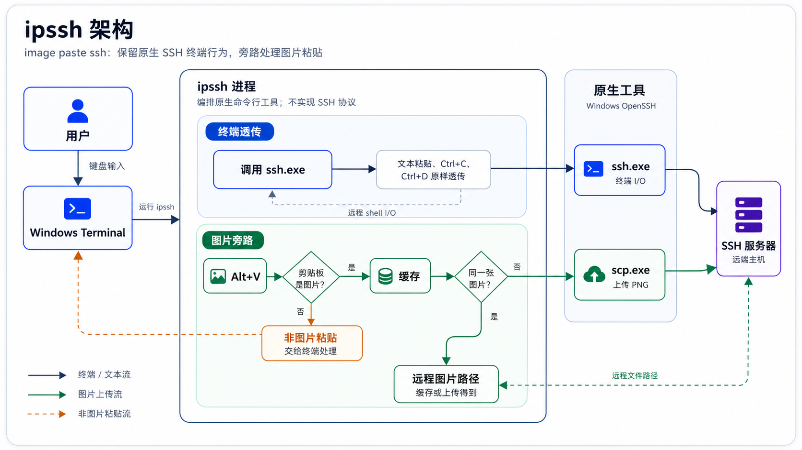

# ipssh 设计

[English](design.md)

本文描述 `ipssh` 的最终设计。早期设计记录和实现计划已经合并到本文档中。

## 目标

`ipssh` 是 image paste ssh 的缩写。它是一个 Windows 命令行工具，围绕 OpenSSH 做一层很薄的包装：

- 启动正常的交互式 `ssh.exe` 会话。
- 检测配置的图片粘贴快捷键，默认是 `Alt+V`。
- 如果 Windows 剪贴板中是图片，就用 `scp.exe` 上传到 SSH 目标。
- 把生成的远端图片路径粘贴到当前 SSH 会话。
- 普通终端行为交给 Windows Terminal 和 OpenSSH。

它不管理 SSH 凭据、密钥、agent、密码、终端模拟或远端辅助进程。

## 问题背景

远程 AI 编程工作流越来越多发生在 SSH 会话中。Claude Code、Codex 等终端型工具可以受益于截图、UI 捕获、架构图等图片上下文，但普通 SSH 终端没有方便的剪贴板图片粘贴能力。

文本粘贴也必须保持可靠。一些 SSH 客户端或终端包装器会错误处理多行粘贴，把粘贴内容当成多条 shell 命令执行。`ipssh` 的目标是在不接管普通终端粘贴行为的前提下，额外增加图片粘贴能力。

`ipssh` 不实现 SSH 协议。它依赖用户已经安装的 OpenSSH 命令行工具，即 `ssh.exe` 和 `scp.exe`，通常来自 Windows 自带 OpenSSH 或 Windows Git 安装包。

## 最终架构

当前架构避免自定义终端桥接。`ssh.exe` 作为普通子进程启动，并继承当前控制台的 stdin/stdout/stderr。这保留了文本粘贴、多行粘贴、`Shift+Insert`、`Ctrl+C`、`Ctrl+D`、颜色、终端控制序列和全屏程序的 OpenSSH 原生行为。

`ipssh` 额外启动一个旁路工作线程。该线程为配置的快捷键安装低级 Windows 键盘钩子。钩子观察 keydown 事件并通知工作线程；它不消费或改写键盘输入。工作线程随后检查剪贴板。只有图片剪贴板内容由 `ipssh` 处理。工作线程维护一个单项内存缓存，记录上一次上传的剪贴板图片和渲染后的远端路径。



## 模块职责

- `src/lib.rs`：CLI 解析、配置加载、SSH 参数解析和顶层编排。
- `src/config.rs`：TOML 配置加载、默认值和命令行覆盖合并。
- `src/hotkey.rs`：解析 `alt+v` 等快捷键字符串，并提供物理按键状态辅助函数。
- `src/ssh_args.rs`：识别 SSH 目标，并把相关 `ssh` 参数转换为 `scp` 参数。
- `src/remote_path.rs`：生成文件名和远端路径。
- `src/template.rs`：根据 `{remote_path}`、`{remote_dir}`、`{filename}` 渲染插入文本。
- `src/clipboard.rs`：读取 Windows 剪贴板图片/文本数据，并把图片保存为 PNG。
- `src/uploader.rs`：运行 `ssh` 创建远端目录，并运行 `scp` 上传文件。
- `src/terminal.rs`：运行 OpenSSH 会话，管理图片快捷键工作线程，并粘贴上传后的路径。
- `packaging/windows/installer`：构建按用户安装的 Windows 安装器。

## 数据流

1. 用户运行 `ipssh [tool-options] -- [ssh-options] <target>`。
2. `ipssh` 加载 `%APPDATA%\ipssh\config.toml`，除非用户提供自定义配置路径。
3. `ipssh` 启动后台图片快捷键工作线程。
4. `ipssh` 使用用户提供的 SSH 参数启动 `ssh.exe`。
5. `ssh.exe` 拥有交互式终端会话。
6. 按下配置的快捷键时，工作线程检查剪贴板。
7. 如果剪贴板不是图片，工作线程不做处理。
8. 如果剪贴板是图片：
   - 用图片宽度、高度和 RGBA 字节与上一次上传的剪贴板图片比较。
   - 如果未变化，复用缓存的渲染远端路径，跳过上传。
   - 保存为临时 PNG。
   - 生成远端路径。
   - 运行 `ssh <args> mkdir -p <remote_dir>`。
   - 运行 `scp <converted args> <temp.png> <target>:<remote_path>`。
   - 渲染配置的模板。
   - 等待快捷键按键释放。
   - 临时把 Windows 剪贴板设置为渲染文本。
   - 模拟 `Shift+Insert`，让当前终端粘贴文本。
   - 尽可能恢复之前的剪贴板内容。
9. `ssh.exe` 退出后，`ipssh` 停止工作线程并返回 SSH 退出码。

## 关键设计决策

### OpenSSH 拥有终端

项目曾探索过 ConPTY 桥接和原始输入处理。那种方案会让 `ipssh` 负责重建终端输入和粘贴语义，容易在多行粘贴和终端转义序列上与普通 OpenSSH 产生细微差异。

最终设计让 `ssh.exe` 和 Windows Terminal 负责终端。这保留了正常 SSH 行为，也让图片功能成为旁路能力，而不是终端替代品。

### 只处理图片

配置的快捷键是图片上传快捷键，不是通用粘贴实现。

如果剪贴板包含文本、空数据或不支持的数据，`ipssh` 不做处理。原生终端粘贴行为继续生效。这对 `Shift+Insert` 和多行文本粘贴尤其重要。

### 重复图片缓存

在一个 `ipssh` 会话内，工作线程记住最近一次上传的剪贴板图片，以及已经粘贴的远端路径。如果下一次图片快捷键看到相同的宽度、高度和 RGBA 字节，就认为图片未变化，跳过 `ssh`/`scp`，直接再次粘贴同一路径。不同图片会在上传成功后替换缓存。

### 低级键盘钩子

定时轮询 `GetAsyncKeyState` 可能漏掉快速快捷键。最终实现使用 `WH_KEYBOARD_LL` 观察配置快捷键的 keydown 事件，使普通快速按键更可靠，同时不消费原始键盘输入。

钩子范围很窄：

- 只匹配配置的主键和必要修饰键。
- 只向工作线程发送通知。
- 调用 `CallNextHookEx`，让终端和其他应用仍然收到按键事件。

### 路径插入使用原生粘贴

上传后，`ipssh` 通过临时设置剪贴板文本并发送 `Shift+Insert` 来插入生成路径。这比逐字符输入更接近普通终端粘贴行为，也避免重新实现 shell/editor 的粘贴语义。

工作线程会等配置快捷键按键释放后再发送 `Shift+Insert`，避免图片快捷键的修饰键影响合成粘贴。

## 配置

默认配置路径：

```text
%APPDATA%\ipssh\config.toml
```

默认配置：

```toml
paste_hotkey = "alt+v"
remote_dir = "~/Pictures/paste-ssh"
image_format = "png"
non_image_paste = "text"
template = "{remote_path}"

[upload]
filename_pattern = "{timestamp}-{random}.{ext}"
```

`non_image_paste` 为兼容早期配置形状而保留，当前行为是把非图片粘贴交给终端。

## SSH 和 SCP 参数处理

主 SSH 会话接收原始 SSH 参数。

上传时，`ipssh` 派生兼容的 `scp` 参数：

- `ssh -p 2222` 转换为 `scp -P 2222`。
- `ssh -p2222` 转换为 `scp -P 2222`。
- 保留 `-i`、`-F`、`-J` 和 `-o`。
- SSH 目标会从选项处理里移除，然后重新组合为 `<target>:<remote_path>`。

OpenSSH 继续负责认证和主机配置。

## 错误处理

图片上传失败是本地错误，不会终止 SSH 会话，也不会粘贴伪造路径。

常见失败包括：

- 无法打开剪贴板。
- 图片无法保存为 PNG。
- 远端 `mkdir -p` 失败。
- `scp` 失败。
- 生成路径无法粘贴。

错误会打印到本地终端，例如 `ipssh paste failed: ...` 或 `ipssh hotkey worker failed: ...`。

## 测试策略

自动化测试覆盖：

- 配置默认值和覆盖顺序。
- 快捷键解析和匹配。
- SSH 参数解析和 SCP 转换。
- 远端路径生成。
- 模板渲染。
- 剪贴板图片保存行为。
- 上传命令构造。
- 只处理图片的快捷键语义。
- 键盘钩子快捷键匹配逻辑。
- 重复相同剪贴板图片时复用缓存路径，不重复上传。
- 剪贴板图片内容变化时重新上传。
- CLI 冒烟行为。
- 安装器配置路径和旧配置迁移。

手动和端到端检查应覆盖：

- 连接真实 SSH 服务器。
- `Ctrl+D` 返回本地命令提示符。
- `Shift+Insert` 多行粘贴表现与普通 OpenSSH 一致。
- 剪贴板中是图片时快速按 `Alt+V` 能上传并粘贴远端路径。
- 剪贴板中是文本时按配置快捷键不会触发上传。
- 上传失败不会终止 SSH 会话，也不会粘贴路径。

## 打包

Windows 安装器是一个小型 Rust 二进制，内嵌：

- `target\release\ipssh.exe`
- `packaging\windows\default-config.toml`

按用户安装到：

```text
Binary: %LOCALAPPDATA%\Programs\ipssh\ipssh.exe
Config: %APPDATA%\ipssh\config.toml
```

它也可以添加或移除用户 `PATH` 中的安装目录。
